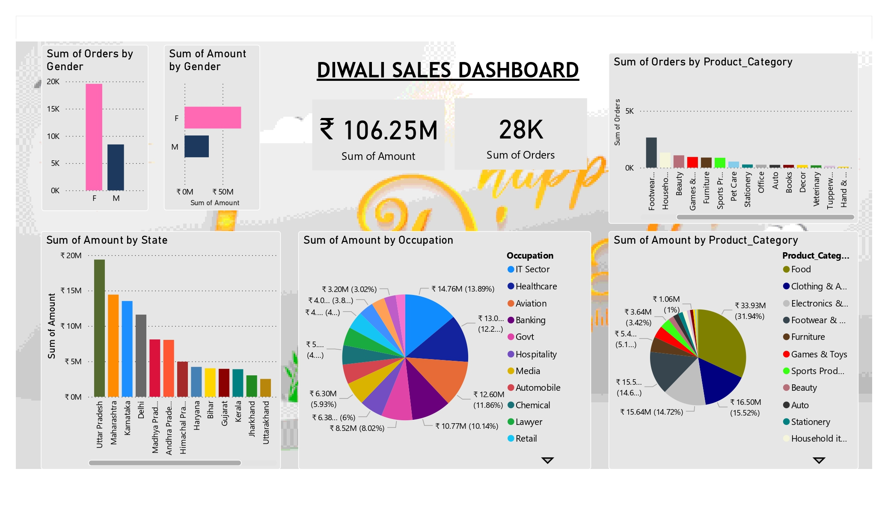

# 🛍️ Customer Shopping Behavior Analysis (Diwali Sales) 📊

This project presents an in-depth analysis of Diwali sales data using exploratory data analysis (EDA) techniques. It focuses on understanding customer behavior, identifying key sales trends, and generating actionable insights to improve business strategies. An interactive Power BI dashboard is also developed to visualize insights effectively.

## 📌 Project Overview

- **Tool Used**: Python | SQL (PostgreSQL) 
- **Tech Stack**: Pandas | NumPy | Matplotlib | Seaborn | Power BI Desktop  
- **Dataset Source**: Kaggle (Diwali Sales Dataset)
- **IDE**: Jupyter Notebook    

## 🔍 Key Features & Insights

### 🎯 Business Objectives
- Improve customer experience through data analysis  
- Increase revenue by identifying sales patterns  
- Identify potential customers based on demographics  
- Recognize top-selling products for better inventory planning  

### 👥 Customer Insights
- Analysis based on **Gender, Age, Marital Status, Occupation, and Location**  
- Identified high-value customer segments  
- Found target customer groups for marketing campaigns  

### 🛒 Sales Insights
- Top-performing product categories  
- Most profitable customer segments  
- Purchase trends across different states and occupations  

## 📊 Analysis Highlights

- Married women (age group 26–35 yrs) from IT, Healthcare, and Aviation sectors are major buyers  
- States like Uttar Pradesh, Maharashtra, and Karnataka contribute most to sales  
- Food, Clothing, and Electronics are top-selling categories  

## 📂 Dataset

- **Source**: [Kaggle - Diwali Sales Dataset](https://www.kaggle.com/datasets/nazishjaveed/diwale-sale-dataset)  
- The dataset contains customer details and purchase records during Diwali sales.  
- It includes demographic information such as age, gender, occupation, and location, along with product and transaction details.

## 📊 Dashboard Preview

